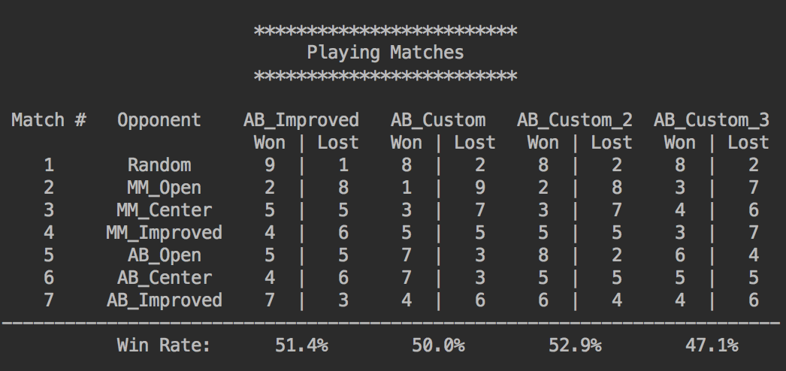

# Heuristic Analytics

## Introduction

This project provides an agent which can play the game Isolation by the help of the minimax
algorithm for determining the moves. The quality of the agent's chosen moves depends on
 the heuristic that is used by the algorithm.
 
## Heuristic Functions

I will give a short summary on the heuristic funtions used for evaluation purposes
 
### Heuristic Function 0

Outputs a score equal to the difference in the number of moves 
available to the two players, while penalizing the moves for the
maximizing player that are in the corner and rewarding the moves for the
minimizing player that are in the corner. These penalties/rewards are
elevated near end game through a game state factor. Submitted

### Heuristic Function 1

**open_move_walls**:  
    Outputs a score equal to the difference in the number of moves
    available to the two players, while penalizing the moves for the
    maximizing player that are against the wall and rewarding the moves
    for the minimizing player that are against the wall. Not submitted.

### Heuristic Function 2

**run_towards**:  
    Minimize the distance between the player and the opponent, i.e., run
    towards from the opponent. Returns the negative of the absolute difference
    between the sum of the location vectors, therefore rewarding smaller
    absolute differences with higher scores. Not submitted.
    
## Evaluation

This is the output of the tournament script, showing the results when playing against
some other AI-players:

Obviously function 2 (**run_towards**) is the best heuristic function. This one has won 
nearly 53% of the games that were played whereas function has only won 50% and function
 3 has won 47%.
 
It seems to be wise to minimize the distance between the player and the opponent.